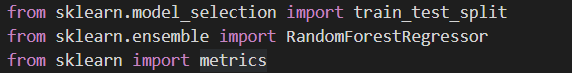
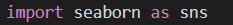
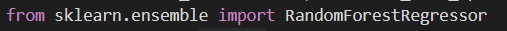
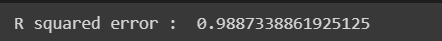

# Gold\_Price\_Prediction

-----
The aim of this project is to predict the prices of gold using a dataset from kaggle and Machine Learning.

# Libraries used:-

-----
- **Numpy**

**Importing Numpy Library**

**About Numpy**

Numpy is a library for the Python programming language, adding support for large, multi-dimensional arrays and matrices, along with a large collection of high-level mathematical functions to operate on these arrays.

- **Pandas**

**Importing Pandas Library**

**About Pandas**

Pandas is a Python package providing fast, flexible, and expressive data structures designed to make working with “relational” or “labeled” data both easy and intuitive. It aims to be the fundamental high-level building block for doing practical, real-world data analysis in Python.

- **Sklearn**

**Importing Sklearn**

**About Sklearn**

Scikit-learn (Sklearn) is the most useful and robust library for machine learning in Python. It provides a selection of efficient tools for machine learning and statistical modeling including classification, regression, clustering and dimensionality reduction via a consistent interface in Python. This library, which is largely written in Python, is built upon NumPy, SciPy and Matplotlib.

**Different functions imported from Sklearn:-**

- **train\_test\_split-** Using [train_test_split()](https://scikit-learn.org/stable/modules/generated/sklearn.model_selection.train_test_split.html) from the data science library [scikit-learn](https://scikit-learn.org/stable/index.html), you can split your dataset into subsets that minimize the potential for bias in your evaluation and validation process.
- **metrics-** This module implements several loss, score, and utility functions to measure classification performance. Some metrics might require probability estimates of the positive class, confidence values, or binary decisions values.

- **Matplolib.pyplot**

**Importing Matplotlib.pyplot**

**About Matplotlib.pyplot**

Matplotlib.pyplot is a collection of functions that make matplotlib work like MATLAB. Each pyplot function makes some change to a figure: e.g., creates a figure, creates a plotting area in a figure, plots some lines in a plotting area, decorates the plot with labels, etc.

- **Seaborn**

**Importing Seaborn** 

**About Seaborn**

Seaborn is a library for making statistical graphics in Python. It builds on top of matplotlib and integrates closely with pandas data structures.It helps you explore and understand your data. Its plotting functions operate on dataframes and arrays containing whole datasets and internally perform the necessary semantic mapping and statistical aggregation to produce informative plots.

# Algorithm used:-

-----
- ` `**Random Forest Regression**

**Importing  Random Forest Regressor**

**About**

Random Forest Regression is a supervised learning algorithm that uses ensemble learning methods for regression. Ensemble learning method is a technique that combines predictions from multiple machine learning algorithms to make a more accurate prediction than a single model.

# Data Analysis:-

-----
- Heat Map based on correlation between various features

White boxes- represents Negative Correlation

Dark Blue boxes- represents Positive Correlation

- Density v/s Gold Graph

# Model Analysis:-

-----
- Based on test data

The investment for a lifetime.

-----

